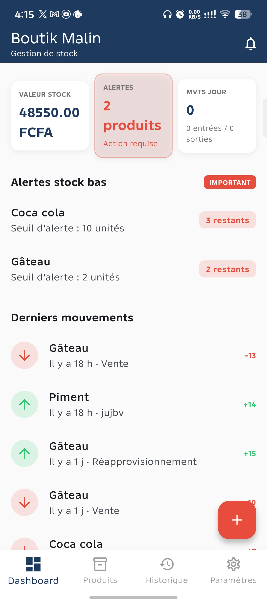
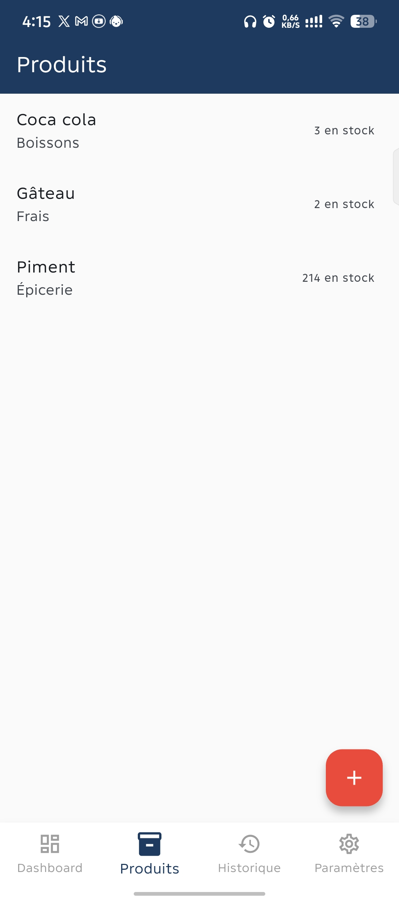
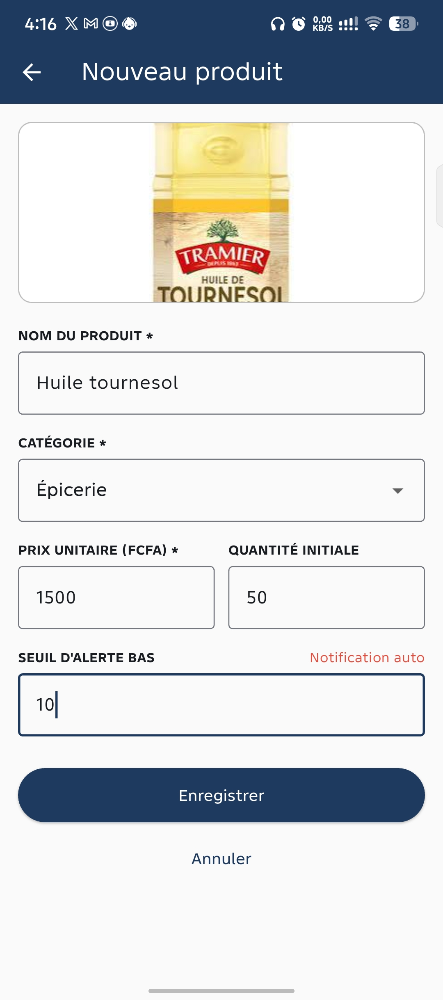
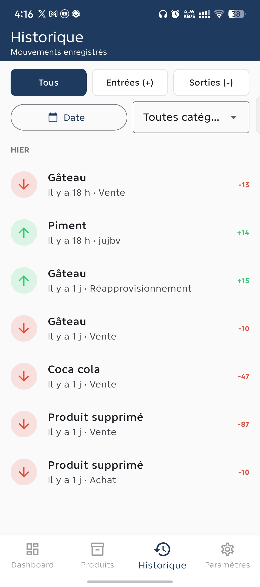
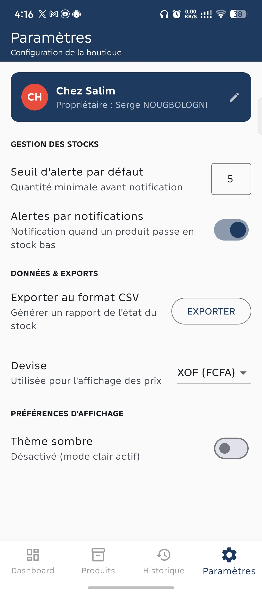
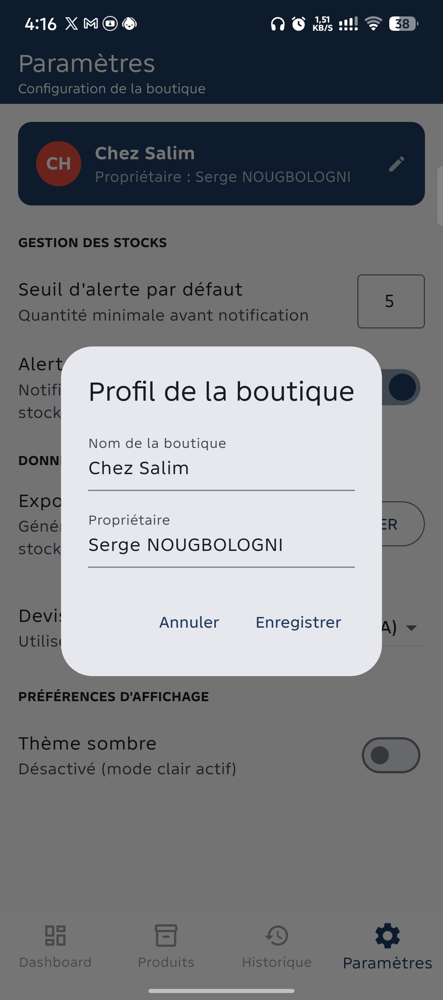

# Boutik Malin

Application mobile Flutter de **gestion de stock** pour commerçants et artisans locaux, développée dans le cadre du parcours "Développement Mobile" (DCLIC / OIF), niveau approfondi.

## Objectif

Boutik Malin permet à un commerçant local de suivre son inventaire (produits, quantités, prix) et d'être alerté quand un produit vient à manquer — sans dépendre d'une connexion internet, l'application fonctionnant entièrement en local sur l'appareil.

Le cahier des charges et les dossiers de conception (visuelle et technique) ont été soumis séparément en semaine 5.

## Fonctionnalités principales

- **Catalogue de produits** : liste avec recherche et filtre par catégorie
- **Fiche produit** : ajout / modification (nom, catégorie, prix unitaire, quantité, seuil d'alerte, photo)
- **Mouvements de stock** : entrées (réapprovisionnement) et sorties (vente/perte), avec motif
- **Historique des mouvements** : filtrable par type, date et catégorie, groupé par jour
- **Alertes de stock bas** : mise en évidence des produits sous leur seuil, avec **notification locale** réelle sur l'appareil
- **Tableau de bord** : valeur totale du stock, produits en alerte, mouvements du jour, derniers mouvements
- **Paramètres** : profil boutique, seuil d'alerte par défaut, devise (EUR / USD / XOF / MAD), export CSV du stock, thème clair/sombre

## Technologies et packages utilisés

- **Flutter** & **Dart**
- **sqflite** + **path** — stockage local (base SQLite embarquée)
- **provider** — gestion d'état (`ChangeNotifier`, `ChangeNotifierProxyProvider`)
- **image_picker** — photo de produit (caméra/galerie)
- **shared_preferences** — préférences (profil boutique, seuil par défaut, devise, thème)
- **flutter_local_notifications** — alertes de stock bas en notification système
- **sqflite_common_ffi** (dev) — exécution de `sqflite` dans les tests automatisés

## Installation

```bash
git clone <url-du-depot>
cd boutik_malin_app
flutter pub get
```

## Lancement de l'application

```bash
flutter run
```

Un appareil Android connecté (USB, débogage activé) ou un émulateur est nécessaire — les notifications locales et le stockage sqflite ne fonctionnent pas sur le mode web.

Pour générer une version installable :
```bash
flutter build apk --debug     # APK de test
flutter build apk --release   # APK final
```

## Tests réalisés

```bash
flutter test
```

- **Tests unitaires** (`test/models/`) : logique métier pure — détection du stock bas (`isLowStock`), calcul de la valeur du stock (`totalValue`), calcul du nouveau stock après un mouvement (`applyMovement`), sérialisation `toMap`/`fromMap`.
- **Test de widget** (`test/widget_test.dart`) : lancement de l'application, présence de la navigation principale.
- **Tests manuels** : parcours complets sur appareil physique (ajout produit → mouvement de stock → alerte → notification → historique).

## Captures d'écran

| Dashboard | Catalogue produits | Nouveau produit |
|---|---|---|
|  |  |  |

| Historique | Paramètres | Édition du profil |
|---|---|---|
|  |  |  |

## Difficultés rencontrées

- **Cohérence fonctionnelle hors ligne** : le concept initial prévoyait un suivi de commandes client, incompatible avec une application 100% locale (le commerçant ne peut pas être notifié d'une commande passée hors ligne). Le projet a été réorienté vers une gestion de stock pure, plus cohérente avec le stockage local.
- **`flutter_local_notifications`** nécessite l'activation du *core library desugaring* dans la configuration Gradle Android (`build.gradle.kts`), sans quoi le build échoue.
- **`sqflite` dans les tests** : le plugin s'appuie sur du code natif Android/iOS, indisponible dans l'environnement `flutter test`. Résolu avec `sqflite_common_ffi`, qui fournit une implémentation SQLite utilisable côté ordinateur pour les tests.
- **Migration de schéma** : l'ajout du champ `productName` à la table des mouvements (pour conserver le nom du produit même après sa suppression) a nécessité une vraie migration (`onUpgrade`) plutôt qu'un simple changement du `CREATE TABLE`, la base existant déjà sur l'appareil de test.
- **Bugs d'interface** : `BottomNavigationBar` rendant les icônes non sélectionnées invisibles (type `shifting` par défaut au-delà de 3 onglets), et un débordement de layout (`RIGHT OVERFLOWED`) sur les filtres de l'écran Historique.

## Auteur

Amour Serge NOUGBOLOGNI
anougbologni@gmail.com
